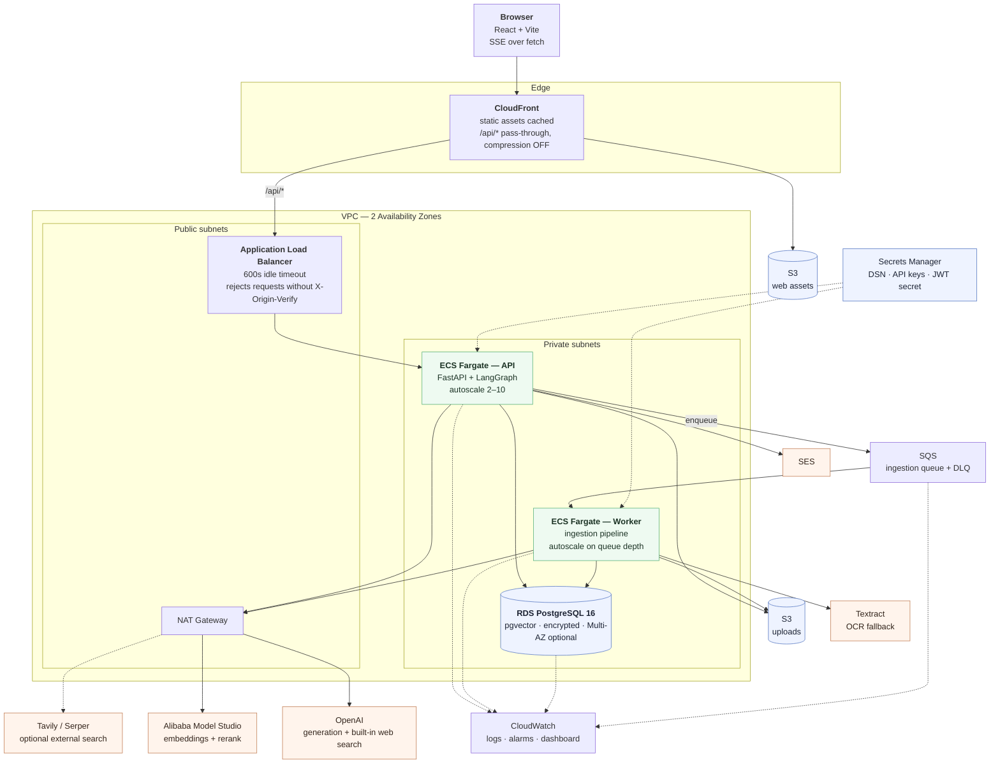
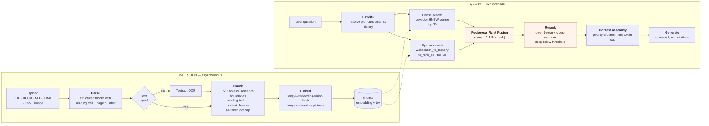
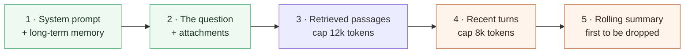
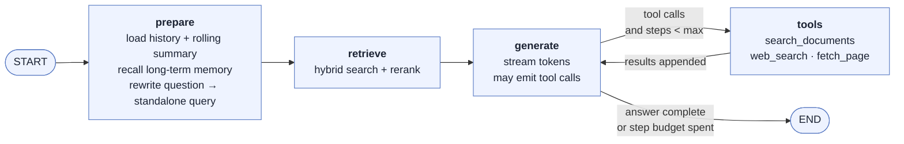
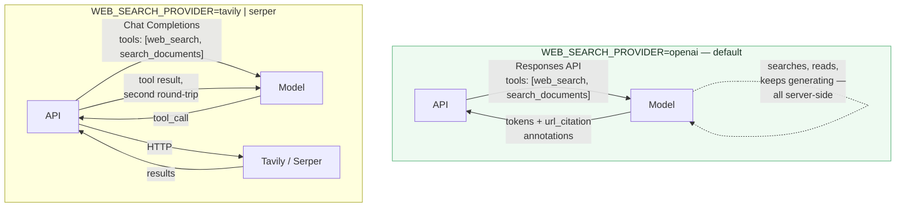
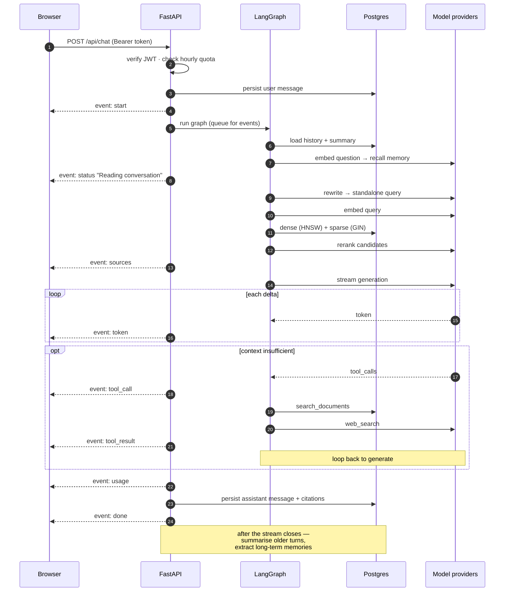
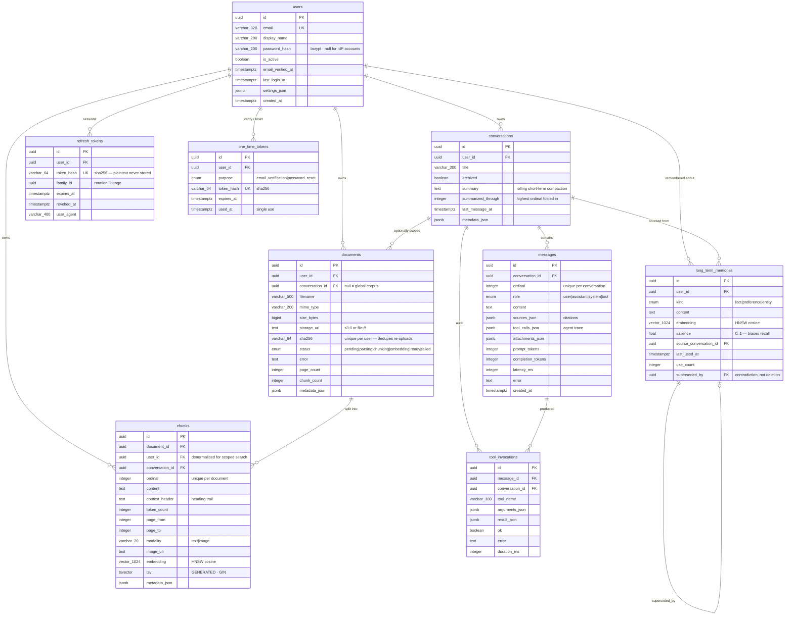
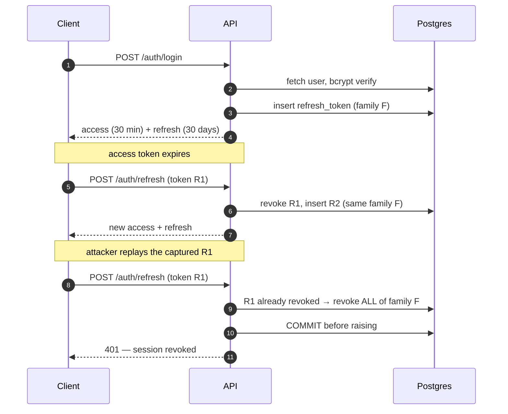
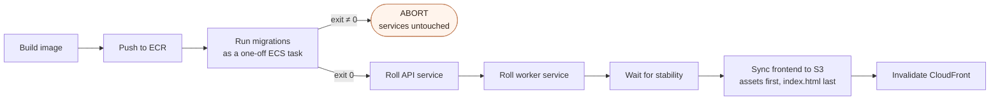

# Agentic RAG on AWS

Retrieval-augmented chat with a bounded agent loop: hybrid retrieval over your
own documents, cross-encoder reranking, web search as a tool, two-tier memory,
and token-by-token streaming to a React frontend.

**Stack** — React 18 · FastAPI · LangGraph · PostgreSQL 16 + pgvector ·
SQLAlchemy + Alembic · ECS Fargate · Terraform

| | |
|---|---|
| Generation | OpenAI (streaming, tool calling) |
| Web search | The generation model's own built-in search — no third-party key |
| Embeddings | `tongyi-embedding-vision-flash` — multimodal, Alibaba Model Studio |
| Reranking | `qwen3-rerank` — cross-encoder, Alibaba Model Studio |
| Vector store | pgvector HNSW, cosine |
| Keyword store | Postgres `tsvector` + GIN |

---

## Contents

1. [System architecture](#system-architecture)
2. [The RAG pipeline](#the-rag-pipeline)
3. [The agent loop](#the-agent-loop)
4. [Anatomy of a chat turn](#anatomy-of-a-chat-turn)
5. [Database design](#database-design)
6. [Authentication](#authentication)
7. [Run it locally](#run-it-locally)
8. [Configuration](#configuration)
9. [API](#api)
10. [Deploy to AWS](#deploy-to-aws)
11. [Tests and CI](#tests-and-ci)
12. [Repository layout](#repository-layout)
13. [Known gaps](#known-gaps)

---

## System architecture



### Decisions that shaped this

| Choice | Why |
|---|---|
| **CloudFront compression OFF for `/api/*`** | Compression buffers the response. Token-by-token streaming dies the moment anything buffers. |
| **ALB idle timeout 600s** | A streamed answer with tool calls legitimately runs for minutes. The default 60s severs it mid-sentence. |
| **`X-Origin-Verify` header on the ALB** | The ALB holds a public IP. Requiring a CloudFront-injected secret means the origin cannot be reached directly, bypassing edge protections. |
| **Separate worker service** | Embedding a 200-page PDF is minutes of CPU and provider latency. In the API process it competes with streaming turns for the event loop, and an API deploy mid-ingest silently loses the job. |
| **S3 gateway endpoint** | Upload traffic is the bulk of egress. Routing it through the endpoint instead of the NAT removes the per-GB NAT charge. |
| **Execution role ≠ task role** | The execution role pulls secrets at container start; the task role is what application code holds at runtime. Separating them limits the blast radius if the app is compromised. |

---

## The RAG pipeline



### Where each stage lives

| Stage | Code |
|---|---|
| Parse | [`services/parsing.py`](backend/app/services/parsing.py) |
| OCR fallback | [`services/ocr.py`](backend/app/services/ocr.py) |
| Chunk | [`services/chunking.py`](backend/app/services/chunking.py) |
| Embed | [`services/embeddings.py`](backend/app/services/embeddings.py) |
| Orchestrate ingestion | [`services/ingestion.py`](backend/app/services/ingestion.py) · [`worker.py`](backend/app/worker.py) |
| Hybrid search + RRF | [`services/retrieval.py`](backend/app/services/retrieval.py) |
| Rerank | [`services/reranker.py`](backend/app/services/reranker.py) |
| Context assembly | [`services/context.py`](backend/app/services/context.py) |
| Generation | [`services/llm.py`](backend/app/services/llm.py) |
| Memory | [`services/memory.py`](backend/app/services/memory.py) |
| Agent graph | [`agent/graph.py`](backend/app/agent/graph.py) · [`agent/runner.py`](backend/app/agent/runner.py) |
| Schema | [`db/models.py`](backend/app/db/models.py) |

### Why hybrid, then rerank

Dense search finds paraphrases but misses rare literals — part numbers, error
codes, surnames. Sparse search nails those literals but misses synonyms. RRF
merges the two ranked lists **without needing their scores to share a scale**,
then the cross-encoder does a precision pass over the fused candidates by
scoring each (query, passage) pair jointly instead of comparing two
independently-produced vectors.

Each leg degrades on its own: reranker down → fusion order is used; embeddings
down → sparse still answers.

### Why the heading trail matters

A bare passage reading *"It must be renewed annually"* is unretrievable. Chunking
carries the heading trail into `context_header`, which is both embedded and
indexed into `tsv`, so the same passage becomes *"Billing > Enterprise plans →
It must be renewed annually"*.

This is verifiable: searching `enterprise` matches a chunk whose body never
contains the word, purely through its heading.

### Context budget

Spent in priority order, because when the window is tight the things that must
survive are the system prompt and the actual question — not the tenth passage.



Each section is capped independently so none can starve the others, and the
total is asserted against the model window before the request goes out.

---

## The agent loop



`retrieve` runs **one grounded pass up front**, so the common single-hop question
never pays for a tool round-trip. The model only reaches for tools when the
context does not cover the question. The loop is bounded by `AGENT_MAX_STEPS`;
on the last step the tools are withheld, which forces a final answer instead of
an infinite deliberation.

> **Streaming note.** Graph nodes publish to an `asyncio.Queue` supplied through
> the run config rather than LangGraph's custom-stream writer. That gives true
> token-level delivery with backpressure and keeps the SSE contract independent
> of the LangGraph version in use.

### Web search: native or external

By default the **generation model does its own searching**. No third-party
account, no separate key, and the model reads full pages rather than the snippet
an external API chose to return.



The difference is where the loop closes. Native search never hands the call back
to us — the model searches, reads, and continues generating inside one turn, so
there is no second round-trip and no extra latency. External search costs a full
extra request cycle per search.

Both modes converge on the same UI: hosted searches surface as `tool_call`
events, and `url_citation` annotations are folded into the same numbered
`sources` list document passages use, so citation chips render identically.

| | Native (`openai`) | External (`tavily`/`serper`) |
|---|---|---|
| API surface | Responses | Chat Completions |
| Extra key | none | required |
| Round-trips per search | 0 | 1 |
| Page content | model reads the page | provider's snippet |
| Runs when | `web_search: true` on the request | same |

`OPENAI_WEB_SEARCH_TOOL` sets the hosted tool type (default `web_search`).
Providers have renamed this between releases, so it is configurable — and a
wrong name returns a 400 that the API translates into an actionable message
naming both the setting and the fallback.

The `search_documents` function tool is registered on **both** paths, so the
model can search your documents and the web in the same turn.

---

## Anatomy of a chat turn



Post-turn work (summarisation, memory extraction) happens **after** the response
closes, so its latency never sits in the user's path. `:` comment frames go out
every 15s as heartbeats, so no proxy reaps an idle connection mid-answer.

### Stream protocol

`POST /api/chat` returns `text/event-stream`:

| Event | Payload |
|---|---|
| `start` | conversation + message ids |
| `status` | human-readable step label |
| `sources` | citation list, sent before generation begins |
| `tool_call` / `tool_result` | agent trace |
| `token` | one generation delta |
| `usage` | token counts, latency, step count |
| `done` \| `error` | terminal — exactly one per turn |

---

## Database design



### Index strategy

The two retrieval indexes are the ones that decide whether this system is fast
or unusable. Both are declared **on the models**, not only in the migration, so
`alembic revision --autogenerate` compares against them instead of proposing to
drop them.

| Index | Type | Purpose |
|---|---|---|
| `ix_chunks_embedding_hnsw` | HNSW `vector_cosine_ops`, m=16, ef=64 | Dense retrieval. HNSW beats IVFFlat on recall-per-latency and needs no training pass, so it is correct even on an empty table at deploy time. |
| `ix_chunks_tsv` | GIN on `tsvector` | Sparse retrieval. |
| `ix_ltm_embedding_hnsw` | HNSW `vector_cosine_ops` | Long-term memory recall. |
| `ix_documents_filename_trgm` | GIN `gin_trgm_ops` | Substring / fuzzy filename lookup in the UI. |
| `ix_chunks_user_conv` | btree `(user_id, conversation_id)` | Scopes every search to the owner. |
| `ix_messages_conversation_ordinal` | btree `(conversation_id, ordinal)` | History window and summarisation cutoff. |
| `ix_messages_role_created` | btree `(role, created_at)` | Backs the per-hour message quota. |
| `ix_conversations_user_recent` | btree `(user_id, archived, last_message_at)` | Sidebar ordering. |

### Schema decisions worth knowing

**`chunks.tsv` is a Postgres GENERATED column**, not application-maintained:

```sql
to_tsvector('english', coalesce(context_header, '') || ' ' || content)
```

It cannot drift from the content, and the heading trail is included so a heading
match scores like a body match. SQLAlchemy omits `Computed` columns from
INSERT/UPDATE automatically.

**`chunks.user_id` is denormalised** from `documents`. Retrieval filters on it in
the hot path; joining to `documents` for every candidate would add work to the
one query that must stay fast.

**`messages.ordinal` is monotonic per conversation** with a unique constraint. It
drives the verbatim history window and the summarisation cutoff — wall-clock
timestamps would be ambiguous under concurrent writes.

**`documents.sha256` is unique per user.** Re-uploading identical bytes reuses the
existing document rather than re-embedding it.

**Memory is superseded, never silently overwritten.** A contradiction sets
`superseded_by`, so history stays auditable.

**Refresh tokens carry a `family_id`.** Rotation issues a new row in the same
family; presenting a revoked one revokes the whole family. That converts a
silent token theft into a forced re-login.

### Migrations

| Revision | Contents |
|---|---|
| `0001` | Core schema, pgvector + pg_trgm + pgcrypto, HNSW and GIN indexes |
| `0002` | Password hashes, rotating refresh tokens |
| `0003` | Email verification, password reset tokens |

All three are reversible and verified up → down → up against real Postgres in
CI. `EMBEDDING_DIM` is read by the model, the migration, and the index — change
it and you need a new migration plus a full re-embed.

---

## Authentication



- **Access tokens are stateless and short-lived; refresh tokens are stateful and
  long-lived.** Revocation therefore takes effect within one access-token
  lifetime rather than never.
- **Only hashes are stored** — bcrypt cost 12 for passwords, SHA-256 for refresh
  and one-time tokens.
- **No account enumeration.** Wrong password and unknown account return the same
  error, and the unknown-account path burns equivalent CPU so response timing
  does not distinguish them either. `forgot-password` answers identically for
  known, unknown, and malformed addresses.
- **Length over composition.** Minimum 10 characters, no symbol-class rules —
  complexity requirements push people toward reused passwords.
- A successful password reset revokes **every** refresh token, because a reset is
  the remedy for a compromised account.

`AUTH_MODE=header` restores a header-trusting shortcut for local development;
`Settings` refuses it when `ENVIRONMENT` is staging or prod. To use Cognito or
another OIDC provider, replace `resolve_user` in
[deps.py](backend/app/api/deps.py) — it is the only place identity is read.

---

## Run it locally

Requires Docker and Docker Compose.

```bash
make env
```

Add `OPENAI_API_KEY` and `DASHSCOPE_API_KEY` to the generated `.env`, then:

```bash
make up
```

Web on <http://localhost:8080>, API docs on <http://localhost:8000/docs>.
<http://localhost:8000/api/health/ready> reports which keys are missing and
whether pgvector is installed.

Frontend with hot reload against the containerised API:

```bash
make db && make api
```

```bash
make web
```

With `EMAIL_BACKEND=log` (the default) verification and reset links are printed
to the backend logs, so the whole account flow works without a mail provider.

---

## Configuration

Every knob is an environment variable; see [.env.example](.env.example).

| Variable | Default | Notes |
|---|---|---|
| `GENERATION_MODEL` | `gpt-5.6-luna` | **Verify against your account's model list.** |
| `EMBEDDING_MODEL` | `tongyi-embedding-vision-flash` | |
| `EMBEDDING_DIM` | `1024` | Must match the model's output — see below. |
| `RERANK_MODEL` | `qwen3-rerank` | |
| `DASHSCOPE_BASE_URL` | `https://dashscope-intl.aliyuncs.com` | Use `dashscope.aliyuncs.com` inside mainland China. |
| `WEB_SEARCH_PROVIDER` | `openai` | `openai` (model's built-in), `tavily`, `serper`, `none`. |
| `OPENAI_WEB_SEARCH_TOOL` | `web_search` | Hosted tool type — providers rename this between releases. |
| `MODEL_CONTEXT_WINDOW` | `200000` | Drives the whole context budget. |
| `AGENT_MAX_STEPS` | `6` | Tool rounds before a final answer is forced. |
| `AUTH_MODE` | `jwt` | `header` is local-dev only and refused in prod. |
| `INGESTION_MODE` | `inline` | `sqs` hands documents to the worker. |
| `EMAIL_BACKEND` | `log` | `ses` to send for real. |

### About `EMBEDDING_DIM`

The pgvector column, the HNSW index, and the Alembic migration all read this
value. If it does not match what the model returns, ingestion fails **loudly** at
the first batch with a dimension-mismatch error rather than storing corrupt
vectors.

Changing it later means a new migration **and** re-embedding everything:

```bash
docker compose exec db psql -U postgres -d agentic_rag -c "TRUNCATE chunks, long_term_memories;"
```

Then `make revision m="resize embedding"`, `make migrate`, and re-upload.

---

## API

| Method | Path | Purpose |
|---|---|---|
| `POST` | `/api/chat` | Stream a turn (SSE) |
| `POST` | `/api/search` | Retrieval only — for judging relevance without spending generation tokens |
| `GET` `POST` | `/api/conversations` | List / create |
| `GET` `PATCH` `DELETE` | `/api/conversations/{id}` | Load, rename, delete |
| `POST` | `/api/documents` | Upload; ingestion runs asynchronously |
| `GET` | `/api/documents/{id}` | Poll ingestion status |
| `POST` | `/api/documents/{id}/reingest` | Retry a failed document |
| `DELETE` | `/api/documents/{id}` | Delete document, chunks, and blob |
| `GET` `DELETE` | `/api/memories` | Inspect and forget long-term memory |
| `POST` | `/api/auth/{register,login,refresh,logout,logout-all}` | Session lifecycle |
| `GET` | `/api/auth/me` | Current user |
| `POST` | `/api/account/{verify-email,resend-verification,forgot-password,reset-password}` | Account recovery |
| `GET` | `/api/health/{live,ready}` | Liveness / readiness |

---

## Deploy to AWS

```bash
cp infra/terraform/terraform.tfvars.example infra/terraform/terraform.tfvars
```

Fill in your keys, then:

```bash
make tf-init && make tf-apply
```

```bash
make deploy
```

### Deployment sequence



The schema must be ahead of the code, so migrations run first and **abort the
deploy on failure**. The worker runs the same image and rolls alongside the API —
otherwise it keeps executing the previous release against the new schema. Assets
sync before `index.html` so a client never sees new HTML pointing at assets that
do not exist yet.

### What gets created

- **VPC** across 2 AZs — public subnets for the ALB, private for tasks and RDS, S3 gateway endpoint so upload traffic skips the NAT
- **RDS PostgreSQL 16** — gp3, encrypted, automated backups, Performance Insights, slow-query logging at 1s
- **ECS Fargate** — API autoscaling on CPU *and* requests-per-target (a streaming turn holds a connection open, so CPU alone under-reports load); worker autoscaling on queue depth per worker
- **SQS** — ingestion queue with a dead-letter queue after 3 attempts
- **ALB** — 600s idle timeout, rejects anything lacking the CloudFront-injected header
- **CloudFront** — static cached, `/api/*` pass-through with compression disabled
- **S3** — separate private buckets for uploads and web assets
- **Secrets Manager** — DSN, API keys, and a Terraform-generated JWT secret
- **CloudWatch** — dashboard plus alarms on API 5xx, unhealthy targets, p95 latency, RDS CPU / storage / connections, DLQ depth, ingestion backlog age

### Ingestion: inline or queued

`INGESTION_MODE=inline` (default) processes uploads in the API process.
`INGESTION_MODE=sqs` hands them to the worker service.

- **Delivery is at-least-once**, which is safe because `ingest_document` *replaces*
  a document's chunks rather than appending — reprocessing converges instead of
  duplicating passages.
- **The worker heartbeats** the message visibility timeout while a long document
  is in flight, so a slow file is not redelivered to a second worker.
- **A failed enqueue degrades to inline** rather than rejecting the upload. A
  queue outage costs throughput, not documents.
- **Autoscaling tracks queue depth per worker, not CPU** — a worker blocked on
  the embedding provider is idle but very much busy.
- **Anything reaching the DLQ raises an alarm.** Those are documents a user
  uploaded and will never get an answer from.

### Cost note

The default shape (2× Fargate 1 vCPU, 1 worker, `db.t4g.medium`, single NAT)
runs roughly **$180–240/month** before model usage. NAT and RDS dominate. Set
`single_nat_gateway = false` only when you need AZ-level HA; set
`worker_min_capacity = 0` to stop paying for an idle worker at the cost of a
cold start on the first upload.

---

## Tests and CI

```bash
make test
```

```bash
cd frontend && npm test
```

**Backend (66 tests)** — chunk-boundary and overlap behaviour, RRF ranking,
context-budget enforcement and priority order, tool-call reassembly across
stream chunks, password and token semantics, queue message handling, email link
generation.

**Frontend (10 tests)** — the SSE parser: frames split mid-JSON across network
chunks, several frames in one chunk, heartbeats, CRLF from a proxy, malformed
frames, and rate-limit responses.

[`.github/workflows/ci.yml`](.github/workflows/ci.yml) runs on every push and PR:

| Job | Checks |
|---|---|
| backend | ruff, pytest, migrations against real pgvector, **migration-drift check**, downgrade to base |
| frontend | tsc, vitest, production build |
| docker | both images build with layer caching |
| terraform | `fmt -check`, `validate` |

The drift check runs `alembic revision --autogenerate` and fails if it produces
any operations — that is how a model change with no migration is caught before a
deploy rather than after. It identifies the generated file by diffing the
directory listing and arms its cleanup trap *before* running alembic, because a
post-write hook that fails after writing leaves a stray revision that becomes
the new head.

---

## Repository layout

```
backend/
  app/
    agent/      LangGraph nodes, graph wiring, SSE runner, prompts
    api/        routes + dependencies (identity, quotas)
    db/         SQLAlchemy models and session
    services/   parsing, chunking, embeddings, retrieval, rerank,
                memory, context, auth, email, queue, ocr, storage
    tools/      tool schemas, dispatch, web search
    worker.py   SQS ingestion worker
  alembic/      migrations
  tests/
frontend/
  src/
    api/        REST client, SSE parser, auth token handling
    components/ Sidebar, PromptBox, MessageList, Markdown, SourceDrawer,
                AuthScreen, PasswordFlows, LibraryPanel
    hooks/      useChat, useUploads, useAuth
infra/terraform/  VPC, RDS, ECS, SQS, ALB, CloudFront, S3, Secrets, monitoring
scripts/deploy.sh
```

---

## Known gaps

- **The model IDs are unverified.** `gpt-5.6-luna` and `EMBEDDING_DIM=1024` for
  `tongyi-embedding-vision-flash` are configured as specified but not confirmed
  against a live account. Both are a single environment variable away from
  correct, and a wrong dimension fails loudly on the first embedding batch.
- **OCR needs S3.** Textract reads from a bucket, so scanned PDFs cannot be
  OCR'd with `UPLOAD_BACKEND=local`. Ingestion says so explicitly rather than
  failing opaquely.
- **No SSO.** Email/password only. `resolve_user` is the single seam for adding
  an OIDC provider.
- **No local queue.** `make up` runs inline ingestion; exercising the SQS path
  locally needs ElasticMQ or a real queue.
